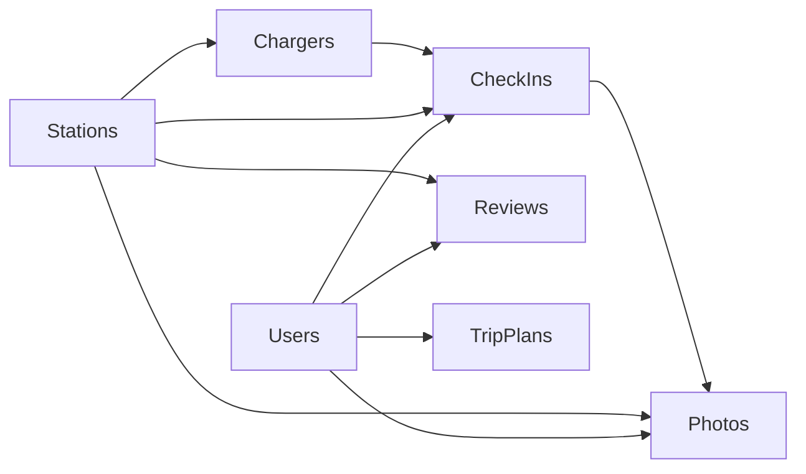

# 🗄️ Complete PlugShare Database Schema

This document outlines the comprehensive database architecture designed to support all PlugShare features including user management, station details, reviews, check-ins, trip planning, and photo sharing.

## 📊 Schema Overview

The database consists of **7 core tables** with carefully designed relationships to support a full-featured EV charging station platform:

### 🔑 Primary Tables

#### 1. **Users** - User account management
- Stores user profiles, authentication, and verification status
- Supports social features like reviews and check-ins
- Links to all user-generated content

#### 2. **Stations** - Comprehensive charging station data
- **Enhanced PlugShare features:**
  - `plugscore` (0-10) - Community-driven reliability rating
  - `amenities` - JSONB array of available services
  - `parking_attributes` - Parking accessibility features  
  - `station_type` - Classification (public/restricted/residential/dealership)
  - `gps_location` - PostGIS geography for spatial queries

#### 3. **Chargers** - Individual charging ports
- Links to parent station with cascade deletion
- Detailed specs: power, plug type, pricing
- Real-time status tracking
- Compatibility flags for different standards

#### 4. **CheckIns** - User activity tracking
- **PlugShare-style features:**
  - Photo sharing with charging sessions
  - Energy consumption tracking (kWh added)
  - Session duration monitoring
  - Status reporting by community
  - Star ratings for individual visits

#### 5. **Reviews** - Detailed station feedback
- **Multi-dimensional ratings:**
  - Overall (1-5 stars)
  - Cleanliness rating
  - Accessibility rating  
  - Reliability rating
- Community moderation with helpful votes
- Rich text reviews with titles

#### 6. **TripPlans** - Route planning and sharing
- **Advanced trip features:**
  - GeoJSON route storage
  - Distance and duration calculations
  - Planned charging stops array
  - Public/private trip sharing
  - GPS coordinates for start/end points

#### 7. **Photos** - User-generated visual content
- Links to stations, check-ins, or standalone
- Caption support and featured photo system
- Community-driven visual documentation

## 🔄 Key Relationships



## ⚡ Advanced Features

### 📈 **Automatic PlugScore Calculation**
The `calculate_plugscore()` function automatically computes station reliability:
- **40% weight:** Average user ratings
- **40% weight:** Uptime based on status reports  
- **20% weight:** Recent community activity

### 🌍 **Spatial Indexing**
- PostGIS `GEOGRAPHY` columns for precise distance calculations
- GiST indexes for fast proximity searches
- Support for route geometry storage

### 🔒 **Row Level Security (RLS)**
- Public read access to stations and reviews
- Users can only modify their own content
- Authenticated user policies for check-ins and trips

### 🚀 **Performance Optimizations**
- **B-tree indexes:** Primary keys, foreign keys, status fields
- **GIN indexes:** JSONB columns (amenities, parking_attributes)
- **GiST indexes:** Geography columns for spatial queries
- **Composite indexes:** Multi-column queries (station + user)

## 🎯 PlugShare Feature Mapping

| PlugShare Feature | Database Implementation |
|------------------|------------------------|
| **Station Map Pins** | `stations` table with `plugscore`, `station_type` |
| **Filters Panel** | JSONB `amenities`, `parking_attributes` columns |
| **Check-in System** | `check_ins` table with photos, ratings, status updates |
| **User Reviews** | `reviews` table with multi-dimensional ratings |
| **Trip Planner** | `trip_plans` table with GeoJSON routes |
| **Photo Sharing** | `photos` table linked to stations/check-ins |
| **Station Details** | Rich `stations` schema with network info, pricing |
| **Community Ratings** | Automatic PlugScore calculation from user activity |

## 📱 API Query Patterns

### **Near Me Search**
```sql
SELECT * FROM stations 
WHERE ST_DWithin(gps_location, ST_Point(lng, lat)::geography, 50000)
ORDER BY gps_location <-> ST_Point(lng, lat)::geography;
```

### **Filter by Amenities**
```sql
SELECT * FROM stations 
WHERE amenities @> '["WiFi", "Restrooms"]'::jsonb;
```

### **Station with Reviews**
```sql
SELECT s.*, AVG(r.rating) as avg_rating, COUNT(r.*) as review_count
FROM stations s
LEFT JOIN reviews r ON s.station_id = r.station_id
GROUP BY s.station_id;
```

## 🔧 Migration & Seeding

### **Apply Schema**
```bash
# Run the comprehensive migration
psql -f supabase/migrations/20250130000000_complete_plugshare_schema.sql

# Seed with realistic data
npm run seed:comprehensive
```

### **Sample Data Included**
- **3 users** with profiles and photos
- **6 stations** with diverse types and amenities  
- **17 chargers** with different power levels and plug types
- **Sample reviews** with multi-dimensional ratings
- **Check-ins** with energy tracking and photos
- **Trip plan** demonstrating route planning

## 🎨 UI Integration

This schema directly supports all PlugShare UI components:

- ✅ **Filters Panel** - Amenities and parking JSONB arrays
- ✅ **Legend System** - Station types and PlugScore ratings  
- ✅ **Map Pins** - Color coding based on type and status
- ✅ **Station Details** - Rich information display
- ✅ **Check-in Flow** - Photo uploads and session tracking
- ✅ **Review System** - Multi-rating feedback
- ✅ **Trip Planning** - Route storage and station selection

The schema is production-ready and scalable to support thousands of users and stations while maintaining fast query performance through proper indexing and PostGIS spatial optimization.

